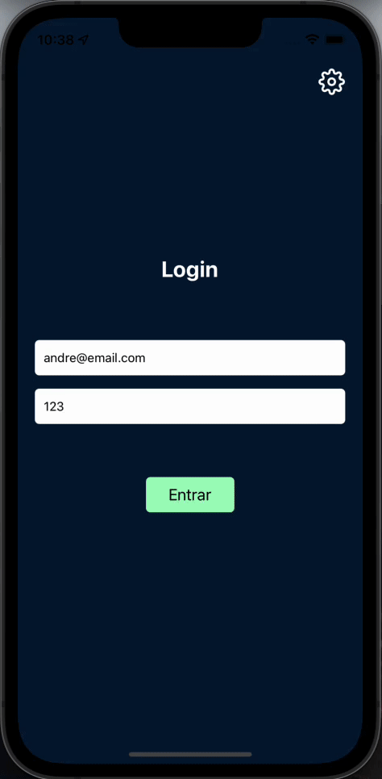

<h1 align="center">
    
</h1>

<h4 align="center"> 
	AluraCommerce
</h4>

<p align="center">
  <a href="#information_source-o-que-é-o-ficando-online">O que é o AluraCommerce?</a>&nbsp;&nbsp;&nbsp;|&nbsp;&nbsp;&nbsp;
  <a href="#rocket-Tecnologias">Tecnologias</a>&nbsp;&nbsp;&nbsp;|&nbsp;&nbsp;&nbsp;
  <a href="#information_source-como-usar">Como usar</a>&nbsp;&nbsp;&nbsp;|&nbsp;&nbsp;&nbsp;
</p>

## :information_source: O que é o AluraCommerce?

O AluraCommerce é uma aplicação feita em React Native que simula um e-commerce. A ideia é usar o Context API, do react, para ver a vantagem de se ter estados globais na aplicação. Também é usado o AsyncStorage e uma Web API para ter a persistência dos dados.

Esse projeto é utilizado na formação base de React Native da plataforma da Alura.


<h1 align="center">
    
</h1>


## :rocket: Tecnologias

Esse projeto foi desenvolvido com a utilização das seguintes tecnologias:
- [React Native][rn]
- [Expo][expo]

## :information_source: Como usar

Para copiar e executar essa aplicação, você precisa de três pré-requisitos: [Git](https://git-scm.com), [Node.js][nodejs] + [Yarn][yarn] intalados no seu computador.

No terminal, digite os comandos a seguir:

### Baixar e instalar o projeto

```bash
# Clonar esse repositório
$ git clone https://github.com/alura-cursos/react-native-context-api.git

# Vá para o ropositório
$ cd AluraCommerce

# Instale as dependências
$ npm install
```

### Executar o Mobile

```bash
# Execute em outro terminal (dentro da pasta AluraCommerce)
$ expo start
```

### Executar a Web API

```bash
# Execute em outro terminal (dentro da pasta AluraCommerce)
# Lembre-se de alterar o endereco ip (192.168.15.43) para o do seu computador!
$ json-server --watch --host 192.168.15.43 db.json
```


Espero que você utilize ao máximo deste projeto para se aprimorar! E se quiser dar um salve, estou lá no LinkedIn [André Oliveira Cunha](https://www.linkedin.com/in/andr%C3%A9-oliveira-cunha-b26b3a156/). :wave: 

[nodejs]: https://nodejs.org/
[expo]: https://docs.expo.dev/
[rn]: https://facebook.github.io/react-native/
[yarn]: https://yarnpkg.com/
